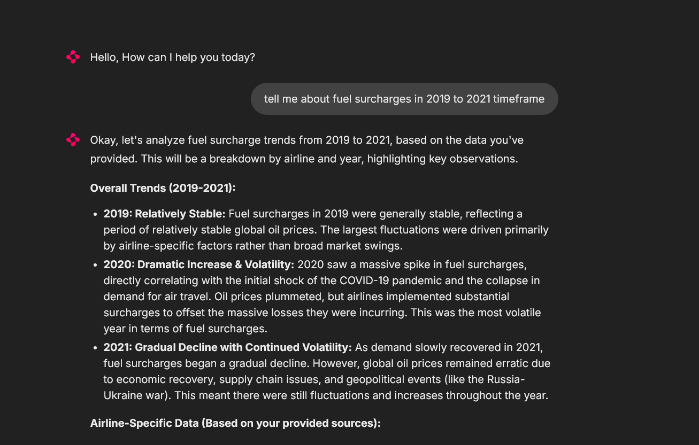

# Observations with screenshots

1. Check if previous messages are being taken into context. To test this I simply type "Hello" 3 times


As observed, the model responds differently all 3 times since it notices that we did not react to its previous responses and hence returns new ones.

2. We will also be uploading documents about how airline fuel prices were affected during conflict historically. This dataset was downloaded from opensource website Kaggle.
We will run the load_documents_to_chromadb.py file to upload the documents to the vector database. (This is a very processor and GPU intensive task. It took me about 20 minutes to chunk all the documents using an Nvidia RTX 4080 Super GPU)

Output of the chunking:

```Loading documents from: documents
  Loading: documents\jason.txt
Loaded successfully (1 pages/chunks)
  Loading: documents\jason_childhood.txt
Loaded successfully (1 pages/chunks)
  Loading: documents\airline_financial_impact.csv
Loaded successfully (725 pages/chunks)
  Loading: documents\airline_ticket_prices.csv
Loaded successfully (14355 pages/chunks)
  Loading: documents\conflict_oil_events.csv
Loaded successfully (36 pages/chunks)
  Loading: documents\fuel_surcharges.csv
Loaded successfully (10092 pages/chunks)
  Loading: documents\oil_jet_fuel_prices.csv
Loaded successfully (87 pages/chunks)
  Loading: documents\route_cost_impact.csv
Loaded successfully (3132 pages/chunks)

Total documents loaded: 28429

Splitting documents (chunk_size=1000, overlap=200)...
Total chunks created: 28429

Initializing embeddings with model: nomic-embed-text...
Uploading documents to Chroma DB...
  Collection: documents
  Persist directory: ./chroma_db
Adding chunks to Chroma DB: 100%|██████████| 28429/28429 [25:01<00:00, 18.93it/s]
Successfully uploaded documents to Chroma DB
Document loading completed successfully!
Documents processed: 28429
Chunks created: 28429
Chroma DB location: ./chroma_db
```

Now that the chunks are done, we can ask questions about fuel surcharges.



We see that we are getting responses based on the Documents provided to the Vector DB, hence the RAG retrieval works.
